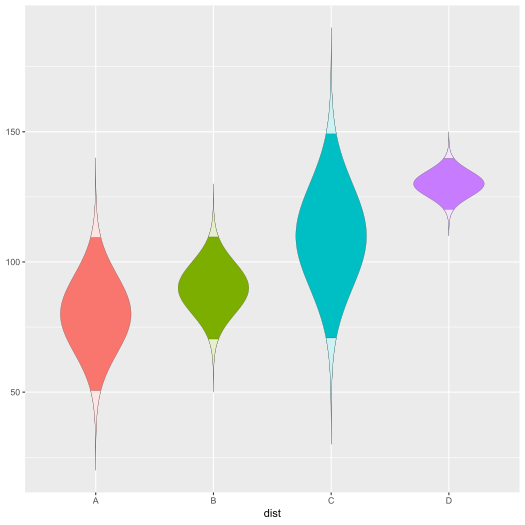
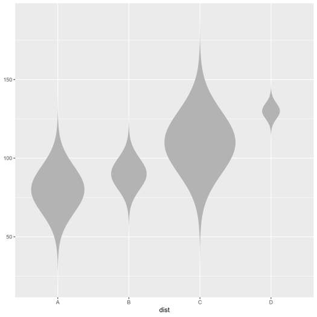
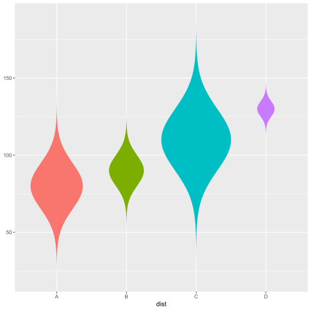
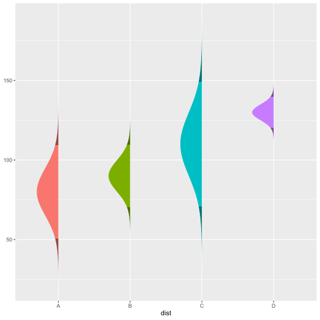
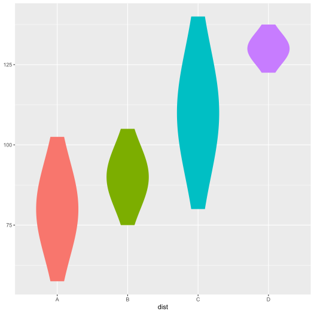
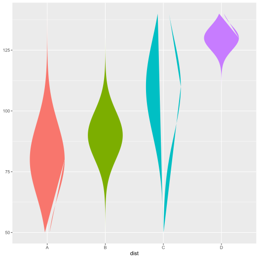
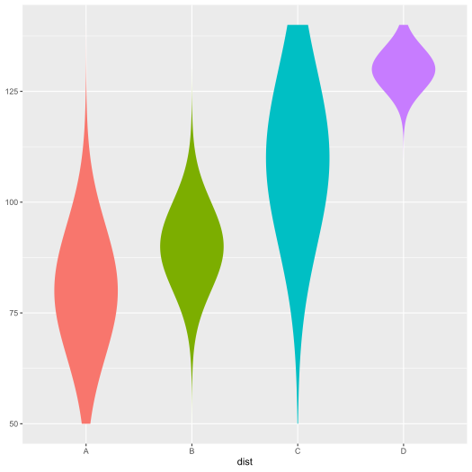
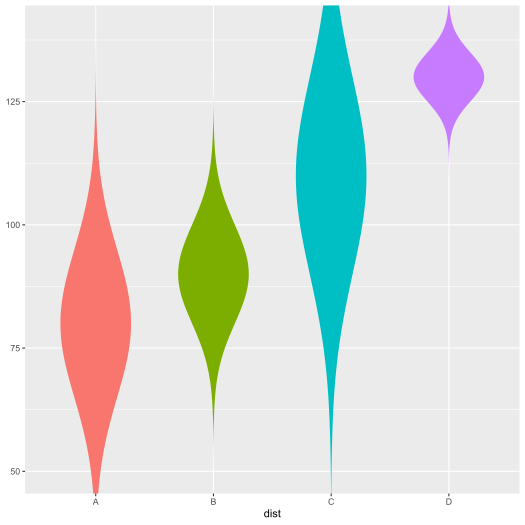

<!-- README.md is generated from README.Rmd. Please edit that file -->

# ggnormalviolin 

[](https://cran.r-project.org/package=ggnormalviolin)
[](https://www.tidyverse.org/lifecycle/#maturing)
[](https://travis-ci.org/wjschne/ggnormalviolin)
[](https://ci.appveyor.com/project/wjschne/ggnormalviolin)

A ggplot2 extension for creating normal violin plots with specified
means and standard deviations.

## Installation

You can either install ggnormalviolin from CRAN or install the
development version of ggnormalviolin from github.

### Option 1: Install the most recent stable release from CRAN

You can install ggnormalviolin from CRAN by running this code:

``` r
install.packages("ggnormalviolin")
```

### Option 2: Install the development version from GitHub

To install the development version of ggnormalviolin, you need to check
if devtools is installed. If not, run this:

``` r
install.packages("devtools")
```

Once you are sure you have devtools installed, you can install the
development version of ggnormalviolin from GitHub by running this code:

``` r
devtools::install_github("wjschne/ggnormalviolin")
```

## Using ggnormalviolin

Suppose there are 4 hypothetically normal distributions with specific
means and standard deviations. They can be plotted like so:

``` r
library(ggplot2)
library(ggnormalviolin)

# Make data
d <- data.frame(
  dist = c("A", "B", "C", "D"),
  dist_mean = c(80, 90, 110, 130),
  dist_sd = c(15, 10, 20, 5)
)

# Make base plot
p <- ggplot(data = d, 
            aes(x = dist,
                mu = dist_mean,
                sigma = dist_sd,
                fill = dist)) +
  theme(legend.position = "none")


# Add normal violins
p + geom_normalviolin()
```


## Tail Highlighting

Suppose you want to highlight the two tails of the distributions. Set
the `p_tails` to specify the total area of the tails. Thus, if `p_tail`
= 0.05, each tail will represent the outermost 2.5% of the distributions
(i.e, 0.05 = 2 \&mult; 0.025).

``` r
p + geom_normalviolin(p_tail = 0.05)
```


Suppose you want to highly only the upper tails. Set `p_upper_tail` to
the proportion desired.

``` r
p + geom_normalviolin(p_upper_tail = 0.05)
```


Analogously, you can highlight only the lower tails by setting the
`p_lower_tail` parameter.

``` r
p + geom_normalviolin(p_lower_tail = 0.05)
```



The defaults for highlighting is accomplished by selecting a subset of
the whole distribution, setting `tail_fill` to black, and making the
then making the black fill transparent by setting `tail_alpha` = 0.4.
Setting these values to other colors and levels of transparency can
dramatically change the look of the plot.

``` r
p + geom_normalviolin(
  p_tail = 0.05, 
  tail_fill = "white", 
  tail_alpha = 0.8,
  color = "gray20",
  size = 0.1
  )
```



## Direction of Violin

If you want to omit the left or right side of the violins, you can set
the `face_left` or `face_right` parameters to `FALSE`.

``` r
p + geom_normalviolin(face_left = FALSE)
```



``` r

p + geom_normalviolin(
  face_right = FALSE, 
  p_tail = 0.05)
```



## Violin Width

You can set the `width` of the violin to any size desired.

``` r
p + geom_normalviolin(width = 1)
```



If you want the shape of the distribution to remain constant, map the
`width` parameter to a multiple of the standard deviation.

``` r
p + geom_normalviolin(aes(width = dist_sd * 0.05))
```


## Setting Limits

By default, the normal violins extend 4 standard deviations in both
directions. Use the `nsigma` parameter to set a different value.

``` r
p + geom_normalviolin(nsigma = 1.5)
```


If you set limits on the y scale, it is possible that some of the
violins will be distorted or cut in pieces.

``` r
p + 
  geom_normalviolin() +
  ylim(50,140)
```



This occurs because data outside the limits is discarded, breaking up
the polygons that compose the violins into smaller pieces. To prevent
such behavior, set the `upper_limit` and `lower_limit` parameters equal
to the same limits you have specified for the y scale (or any other
values you wish).

``` r
p + 
  geom_normalviolin(lower_limit = 50, upper_limit = 140) +
  ylim(50,140)
```



Alternately, you can set the limits in `ggplot2::coord_cartesian`, which
will zoom the plot instead of discarding the data.

``` r
p + 
  geom_normalviolin() +
  coord_cartesian(ylim = c(50, 140)) 
```



## Code of Conduct

Please note that the ‘ggnormalviolin project’ is released with a
[Contributor Code of Conduct](CODE_OF_CONDUCT.md). By contributing to
this project, you agree to abide by its terms.
