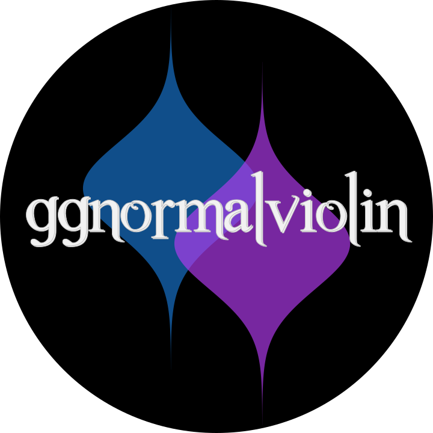

<!-- README.md is generated from README.Rmd. Please edit that file -->

# ggnormalviolin <a href="https://wjschne.github.io/ggnormalviolin/"></a>

<!-- badges: start -->

[](https://CRAN.R-project.org/package=ggnormalviolin)
[](https://lifecycle.r-lib.org/articles/stages.html#stable)
[](https://github.com/wjschne/ggnormalviolin/actions/workflows/R-CMD-check.yaml)
<!-- badges: end -->

A ggplot2 extension for creating normal violin plots with specified
means and standard deviations.

## Installation

You can either install ggnormalviolin from CRAN or install the
development version of ggnormalviolin from github.

### Option 1: Install the most recent stable release from CRAN

You can install ggnormalviolin from CRAN by running this code:

``` r
install.packages("ggnormalviolin")
```

### Option 2: Install the development version from GitHub

To install the development version of ggnormalviolin, you need to check
if the pak package is installed. If not, run this:

``` r
install.packages("pak")
```

Once you are sure you have pak installed, you can install the
development version of ggnormalviolin from [GitHub](https://github.com/)
by running this code:

``` r
pak::pak("wjschne/ggnormalviolin")
```

## Code of Conduct

Please note that the ggnormalviolin project is released with a
[Contributor Code of
Conduct](https://github.com/wjschne/ggnormalviolin/blob/master/CODE_OF_CONDUCT.md).
By contributing to this project, you agree to abide by its terms.
